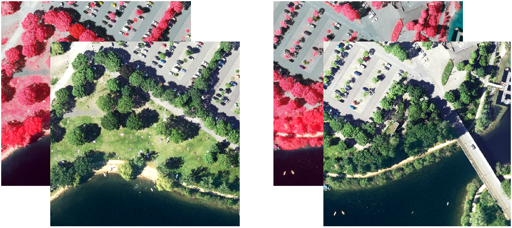

# Open source OBIA

## Content

| notebook | link | description |
| :-------- | -------  | --------- |
| `01_features.ipynb` |  | calculating various feature descriptors (spectral, spatial, textural, contextural) | 
||

## Background

This repo is meant to be a small collection of scripts to showcase how basic object-based image analyses (OBIA) can be performed with standard python libraries. Whereas Trimble eCognition offers the full suite of OBIA algorithms in a proprietary software environment, open source possibilities for OBIA are generally more limited. Still, basic workflows can be realized in python. Besides the obvious advantage of saving on royalties, they can be useful for the following reasons:
1. Easier integration into larger workflows -> when the focus isn't a complex OBIA workflow itself but a rather basic segmentation or some object features needed as interim products in a processing pipeline that otherwise can be realized in python (e.g. machine learning based land cover classification)
2. Enhanced reproducibility -> Whereas repeatability (i.e. obtaining the same results under same conditions by the same people) is also given for processing workflows realized with proprietary software, replicability and reproducibility (aiming at the cross-checking of results by others) is facilitated by relying on open source implementations.           
3. Efficiency -> Although not always the case, the flexibility of multicore processing with thread parallelization can actually lead to a more performant workflow

## Sample Data

For demonstration purposes the following data is used:

A 4-channel orthophoto (R,G,B,NIR) with 10cm ground spacing acquired in North-Rhine Westphalia 2021. 2 smaller subsets out of the original 10.000 X 10.000 pxls orthophoto were formed. The data licence permits the re-use and distribution without restrictions and conditions.

